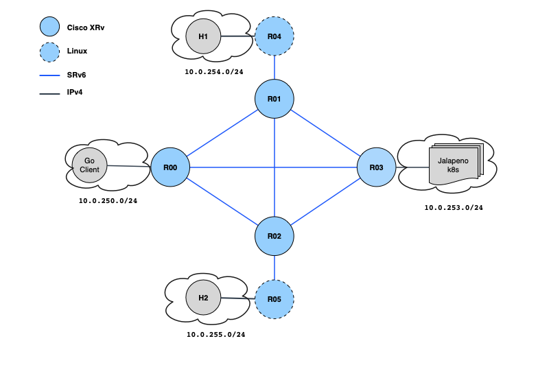

### Jalapeno XRv topology builder

1. Requirements: 
    * ubuntu 18.04, minimum 16 vCPU, 96GB memory, 200GB disk

2. Required packages:
    * openssh-server qemu qemu-kvm libvirt-bin
    * optional: virt-manager

3. Clone this archive

4. Construct router images
```
# May require sudo:

mkdir /opt/images/jalapeno
mv <image_name.qcow2> /opt/images/jalapeno/
cd /opt/images/jalapeno/

# Create .img files from qcow2

qemu-img create -b  xrv9k-fullk9-x-7.2.1.32I.qcow2 -f qcow2 r00.img
qemu-img create -b  xrv9k-fullk9-x-7.2.1.32I.qcow2 -f qcow2 r01.img
qemu-img create -b  xrv9k-fullk9-x-7.2.1.32I.qcow2 -f qcow2 r02.img
qemu-img create -b  xrv9k-fullk9-x-7.2.1.32I.qcow2 -f qcow2 r03.img

```

5. Launch routers via either start_topology.sh script or manually:

```
sudo ./start_topology.sh
```
```
sudo virsh define <router_name.xml>
sudo brctl addbr <bridge_name in xml>
sudo virsh start <router_name>
```
The script and the xml files wil build this topology:



6. Telnet to router console port:
```
# R00 - R03
telnet localhost 20000
telnet localhost 20001
telnet localhost 20002
telnet localhost 20003
```

7. Configure routers once they've fully booted - note the management interfaces have been placed in virbr0 so they may be configured for DHCP


